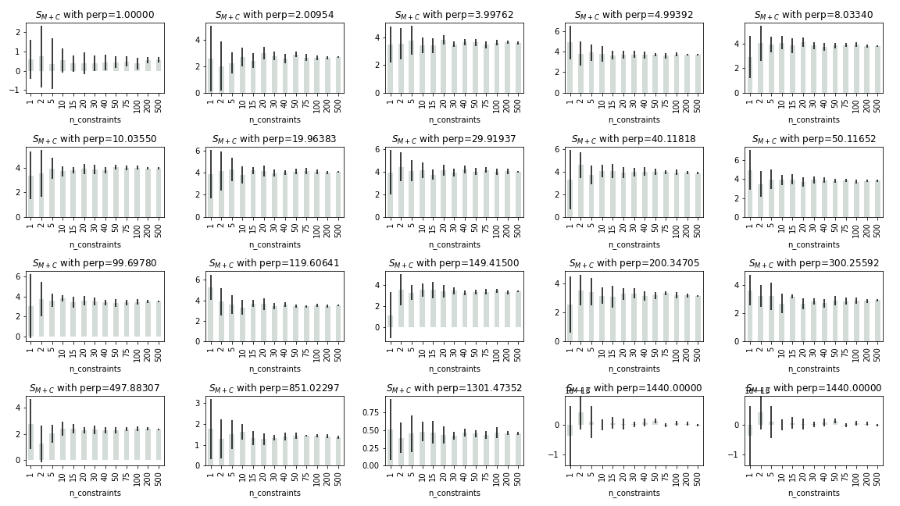
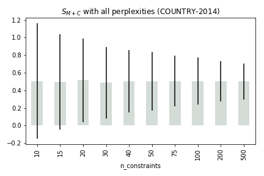
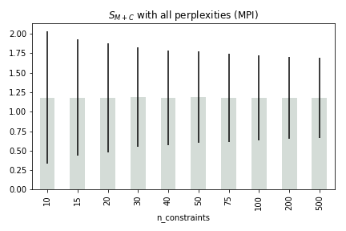
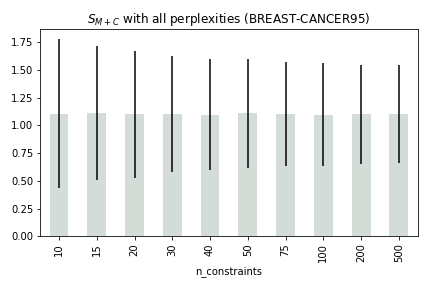
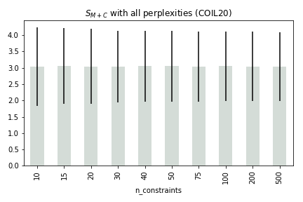
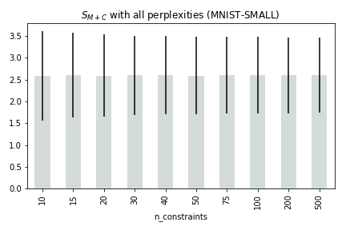

### How does the number of constraints affect the constraint-preserving scores?

1. Observe the plots: mean and std err of $S_{M+C}$ over different number of constraints
### MNIST-SMALL

### COIL20

### BREAST-CANCER95

### MPI

### DIABETES

### COUNTRY-2014

2. For `COUNTRY-2014` and `DIABETES`, the std err is too large.

||||
| :- |:--:| -:|
| |  |  |
| |  |  |

