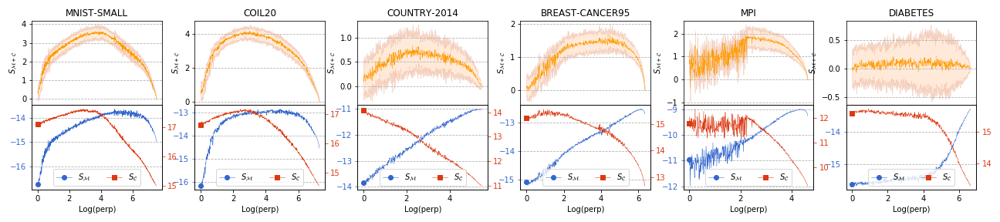

## Notes on new experiments

1. ### Choosing the values of perplexity

    + The number of perplexities should be used?
        * In the previous XPs, we use 32 values of perp:
        > perps = [
        >     1, 2, 3, 4, 5, 6, 7, 8, 9, 10,
        >     12, 14, 16, 18, 20,
        >     25, 30, 35, 40, 45,
        >     50, 60, 70, 80, 90,
        >     100, 150, 200, 250,
        >     300, 400, 500
        >    ]
        
        * A small issue with some small datasets: the value of perplexity should not exceed the number of instances in a dataset.
        
    
    + `perp=10.01` and `perp=10.02` give us different embedding?
        * **Yes**, let see the embeddings of MNIST with some very close perpelxities.
        
        * Normally, we interprete perp as approximated number of neighbors, it is more naturally to be integer. But a very small difference between two very close preplexities leads to two different embeddings, so we should use the decimal values of perp.
    
    + Generate the values of perplexity in log-scale:
        * the number of perps is choosen to be `N//2` with `N` is the number of instances in a dataset.
        * generate the decimal values in log-scale by using:
        ```
        start = np.log(1.0)
        stop = np.log(N)
        n_perps = N//2
        perps = np.logspace(start, stop, n_perps, base=np.e)
        ```

2. ### Meta-map
    + For a dataset, all embedding results with different perplexities are used as feature to generate a meta-map with t-sne.
    + The following params are used: `meta_perps = [2, 5, 10, 20, 30, 35, 40, 45, 50, 75, 100, 150]`
    + Result for some datasets:
    
    
    

3. ### Experiments with different number of constraints
    + Different number of auto-generated constraints are choosen:
    `num_constraints = [1, 2, 5, 10, 15, 20, 30, 40, 50, 75, 100, 200, 500]`
    + For each number of constraint, repeat the constraint generation process `10` times to create different pairs.
    + Observe the average values and the standard errors of constraint-perserving score ($S_{M+C}$) for different number of constraints:
    
    + It is shown that, for some small number of constraints `(1, 2, 5)`, the error is too large. With larger number of constraints (`> 5`), we have a more stable avg value of $S_{M+C}$.

4. ### Comparing the constraint scores and metric scores
    + Plot the values of $S_{M+C}$ with its standard errors:
    
    
    + Cosine distance between a vector of constraint score and a vector of metric score:
    