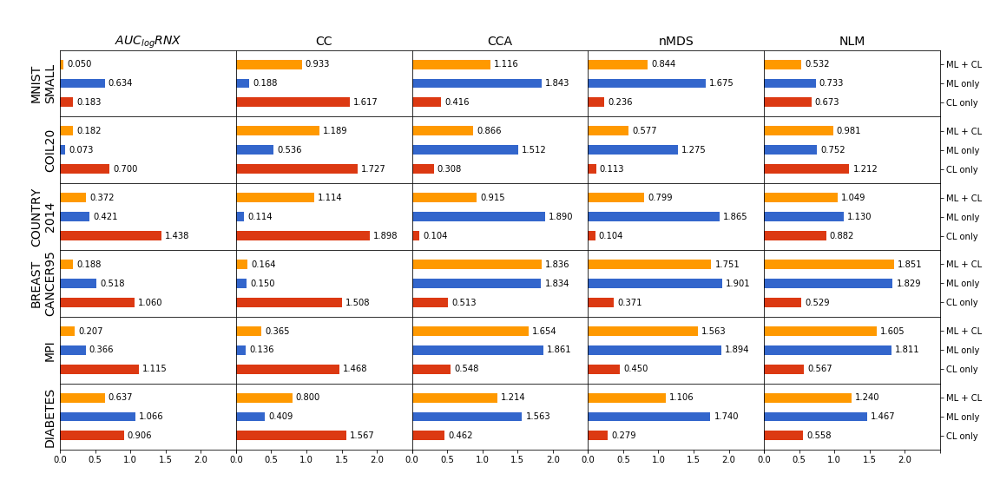

## Notes on new experiments

1. ### Choosing the values of perplexity

    + The number of perplexities should be used?        
        * A small issue with some small datasets: the value of perplexity should not exceed the number of instances in a dataset. _(That can affect the cosine distances between two valued-vectors)_
        
    
    + `perp=10.01` and `perp=10.02` give us different embedding?
        * **Yes**, let see the embeddings of MNIST with some very close perpelxities.
        
        * Normally, we interprete perplexity as approximated number of neighbors, it is more naturally to be integer. But a very small difference between two very close preplexities leads to two different embeddings, so we should use the decimal values for perplexity.
    
    + Generate the values of perplexity in log-scale:
        * the number of perps is choosen to be `N//2` with `N` is the number of instances in a dataset.
        * generate the decimal values in log-scale by using:
        ```
        start = np.log(1.0)
        stop = np.log(N)
        n_perps = N//2
        perps = np.logspace(start, stop, n_perps, base=np.e)
        ```

1. ### Experiments with different number of constraints
    + Different number of auto-generated constraints are choosen:
    `num_constraints = [1, 2, 5, 10, 15, 20, 30, 40, 50, 75, 100, 200, 500]`
    + For each number of constraint, repeat the constraint generation process `10` times to create different pairs.
    + Observe the average values and the standard errors of constraint-perserving score ($S_{M+C}$) for different number of constraints for 2 datasets:
        * MNIST-SMALL (a good case)
        
        * DIABETES ( a bad case)
        
    + It is shown that, for some small number of constraints `(1, 2, 5)`, the error is too large. With larger number of constraints (`> 5`), we have a more stable avg value of $S_{M+C}$ (but not in all cases).

||||
| :- |:--:| -:|
| |  |  |
| |  |  |

1. ### Comparing the constraint scores and metric scores
    + Plot the values of $S_{M+C}$ with its standard errors:
    
    
    Remarks:
        * $S$ is always small for _very small_ and _very large_ perplexity.
        Can we find (numerically) the *good range* for perp? 
        * $S$ is smooth enough for some datasets but not all. (because of the natural of each dataset, or **my fauts in pre-processing step**)

    + Cosine distance between a vector of constraint score and a vector of metric score:
    
        * For all datasets, $S_{M+C}$ is always close to $AUC_{log}RNX$.
        * For (all) datasets, $S_M$ is always close to $CC$.
        * For (all) datasets, $S_C$ is _always_ close to $CCA$ and $nMDS$.
        * Surprisingly, $S_{M+C}$ and $S_M$ only agree with the bounded metric $AUC_{log}RNX$ and $CC$ but never with the unbounded metric $CCA, nMDS$ and $NLM$. In contrast, $S_C$ tends to agree more with the unbounded metrics.

1. ### Meta-map
    + For each dataset, all embedding results with different perplexities are used as features to generate a meta-map with t-sne.
    + Meta params for generate meta-map: `meta_perps = [2, 5, 10, 20, 30, 35, 40, 45, 50, 75, 100, 150]`. Then we observe the result meta-maps and choose the appropriate value of `meta_perp`.
    + Result for some datasets:
    
    
    
    + To discuss: are the meta-maps useful for our method?, how do we use them?        

1. ### Motif for IEEE TVCG paper?
    + A *large & beautiful* interface
    + No/very little math, simple algorithm
    + Should show a `runnable` program, workflow, out results
    + Do not focus on a *big evaluation*, maybe only work on some small datasets.
    + No/little chart, figure for comparison.